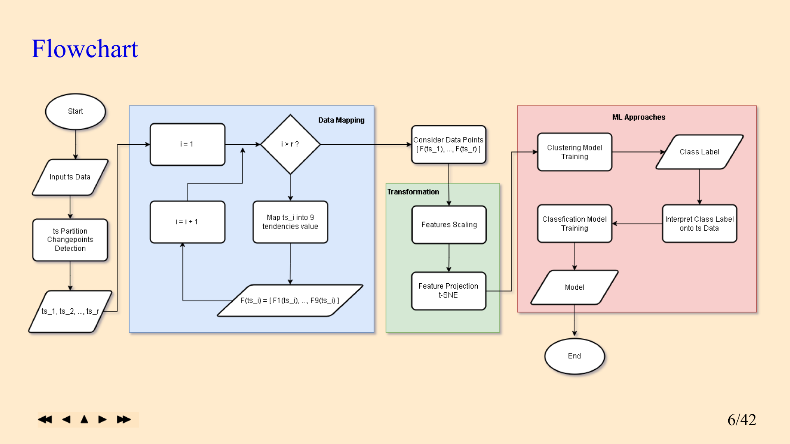
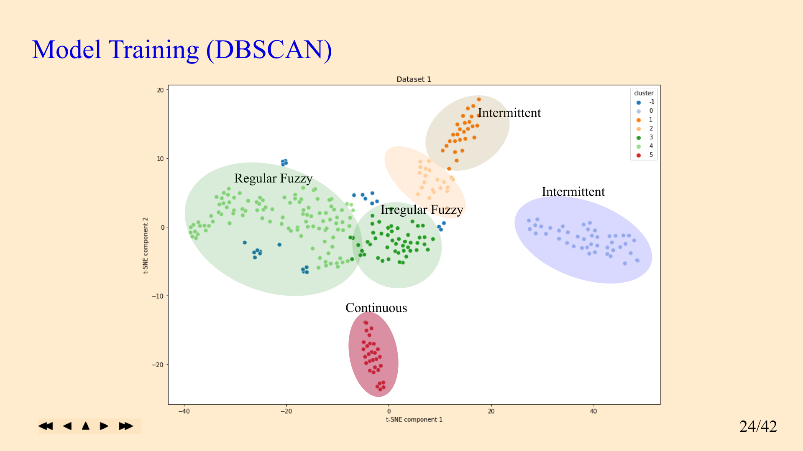
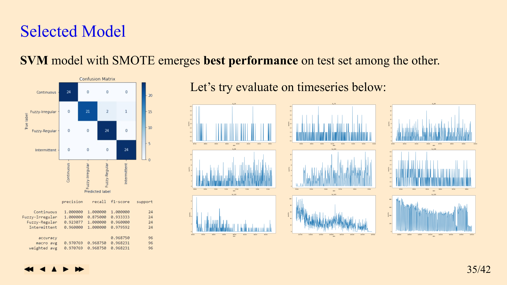
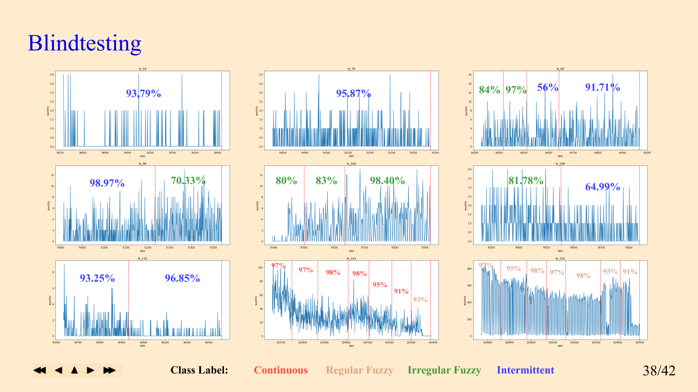

# ➖📈Time Series Type Classification

### 📌 Overview

Time series forecasting often struggles when underlying data patterns shift over time. This project addresses non-stationarity by combining changepoint detection 
with classification algorithm to classify time series partitions into continuous, intermittent, or fuzzy pattern. 
The goal is to optimize time series predictive modeling by dynamically handling each distinct time series type.

--

### ⏹️ Project Highlight

<table>
  <tr>
    <td align="center">
       
    </td>
    <td align="center">
       
    </td>
  </tr>
  <tr>
    <td align="center">
       
    </td>
    <td align="center">
       
    </td>
  </tr>
</table>

<!--
| | |
| :---: | :---: |
|  |  |
|  |  |
-->
